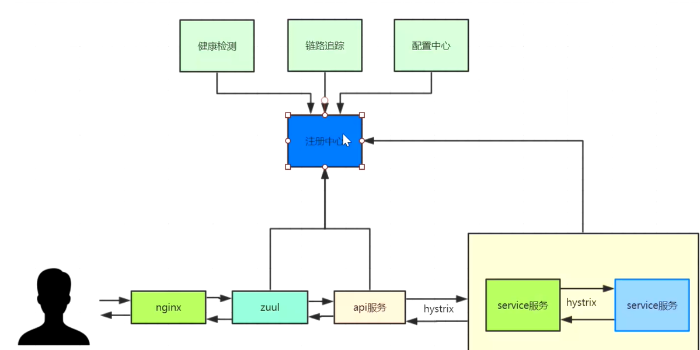
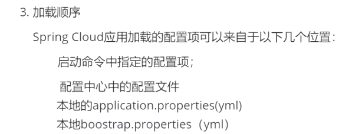
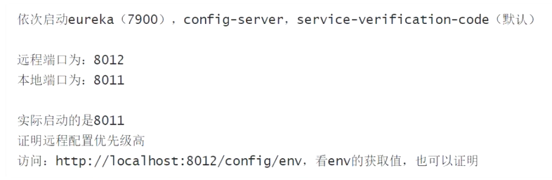
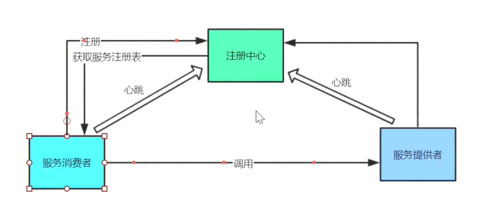
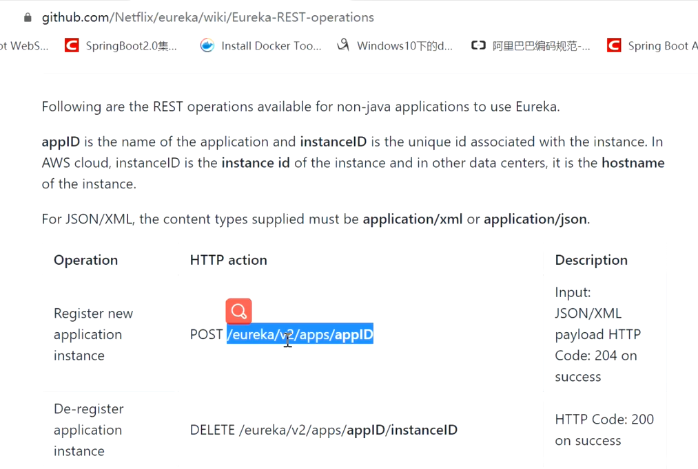
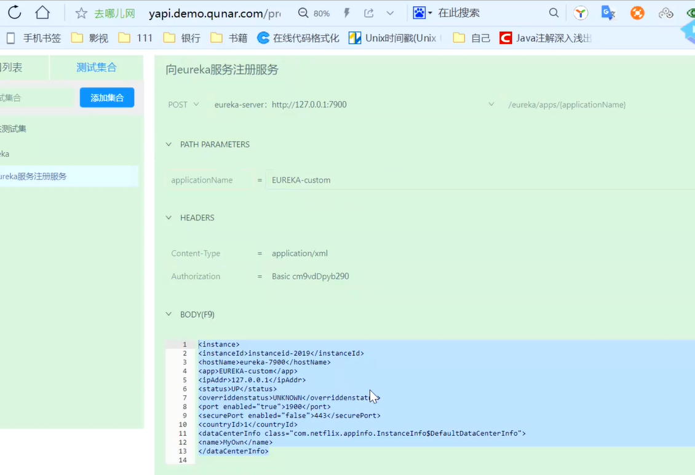
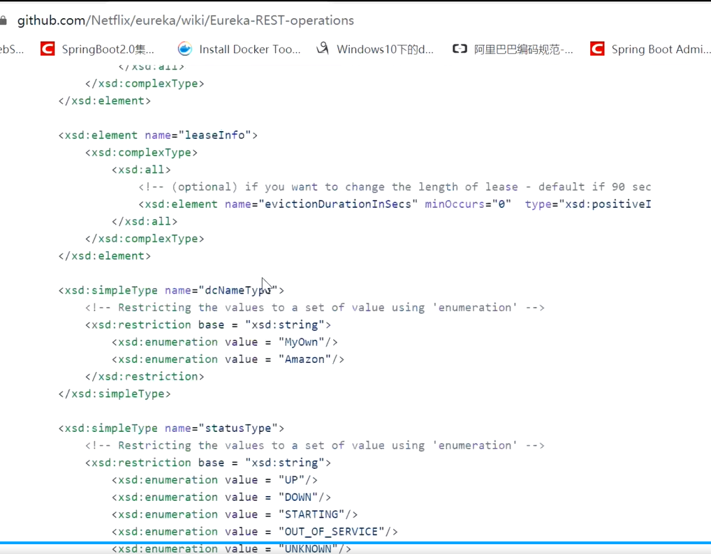

#### 书：淘宝技术这10年

springcloud：GreenWich 2.1.X SR2/4

springboot: 2.1.7Realse

配置：git管理

springcloud是基于springboot集成的各种组件

dubbo：基于netty长连接，效率高

部署：docker和k8s

环境：jdk1.8+maven3.6.1+STS+lombok

springcloud基石：

springcloud context

Spring cloud common:定义了微服务的抽象

配置文件：springcloud启动会创建一个bootsrap上下文，bootstrap.yml负责从外部环境加载配置，优先级最高，它的配置不会被其他配置文件覆盖；

注册中心：Eureka,Nacos,Consul,Zookeeper

peer

#### 注册中心搭建

Eureka Server与Eureka client 之间的联系通过心跳来维持

搭建高可用

#### 使用工具模拟向注册中心注册服务

https://shared-code.com/article/63

https://hellosean1025.github.io/yapi/documents/index.html

https://github.com/Netflix/eureka/wiki/Eureka-REST-operations

##### Eurkea注册规范

